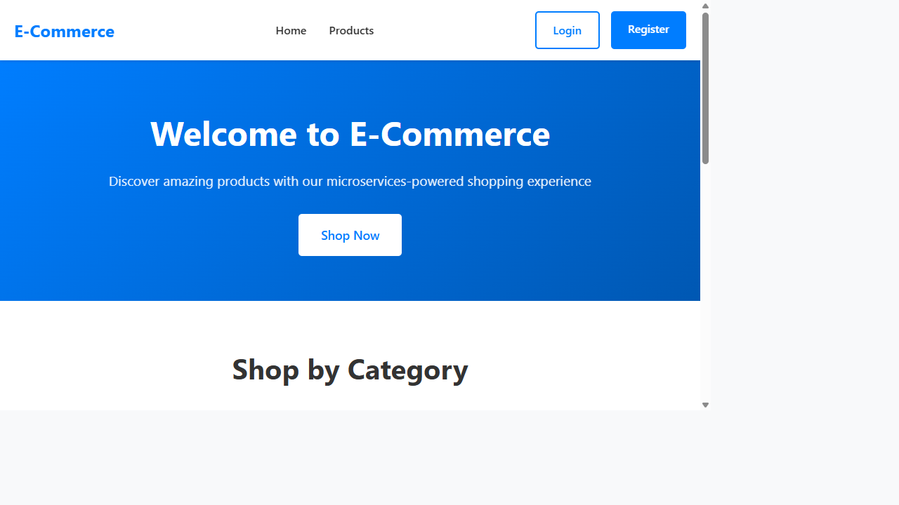
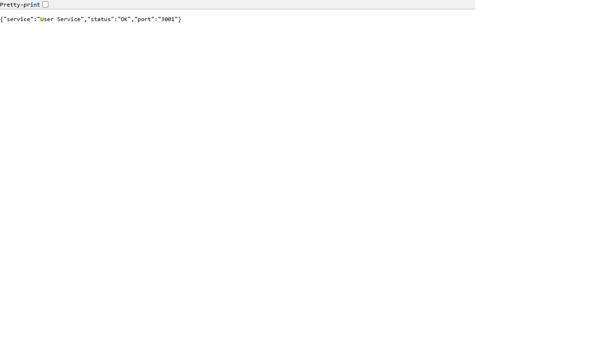
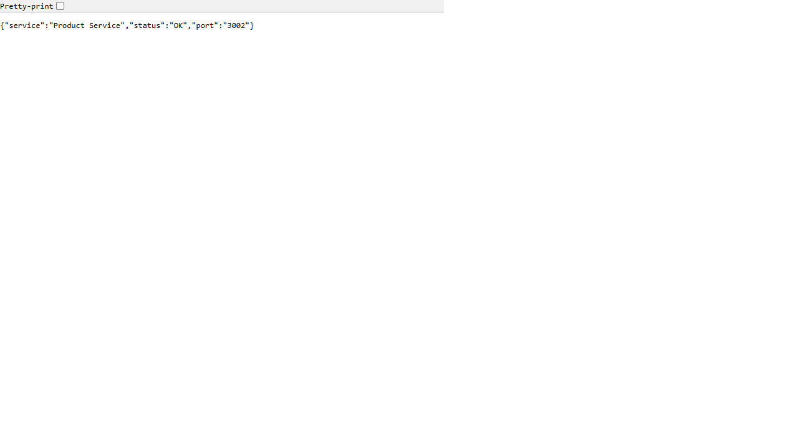
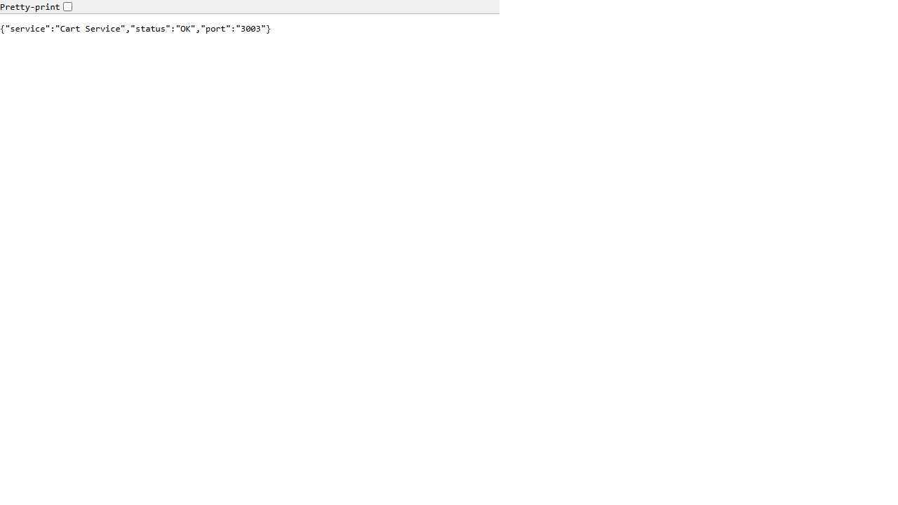
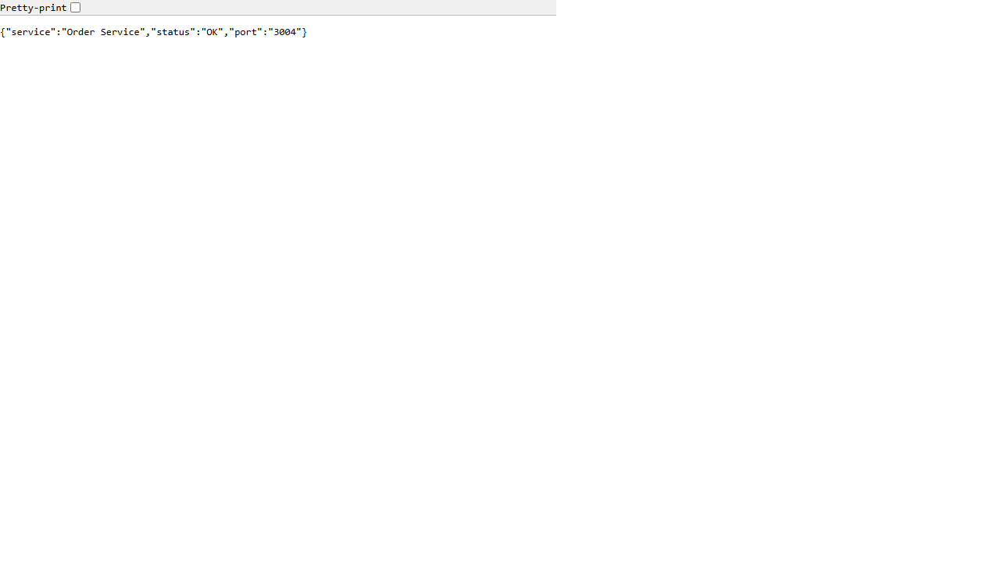

# E-Commerce Microservices - Terraform & Docker Deployment

## Assignment: Deploy a Multi-Service Node.js E-commerce Application Using Terraform and Docker

---

## Deployment Details

| Component | URL / Value |
|-----------|-------------|
| **Frontend** | http://3.109.48.250 |
| **User Service** | http://3.109.48.250:3001/health |
| **Product Service** | http://3.109.48.250:3002/health |
| **Cart Service** | http://3.109.48.250:3003/health |
| **Order Service** | http://3.109.48.250:3004/health |
| **Public DNS** | ec2-3-109-48-250.ap-south-1.compute.amazonaws.com |
| **AWS Region** | ap-south-1 (Mumbai) |
| **Instance Type** | t2.medium |
| **DockerHub** | [rohanm95](https://hub.docker.com/u/rohanm95) |

---

## Architecture

```
                    ┌─────────────────────────────────────────────┐
                    │              AWS VPC (10.0.0.0/16)           │
                    │  ┌───────────────────────────────────────┐  │
                    │  │     Public Subnet (10.0.1.0/24)       │  │
                    │  │                                       │  │
  Internet ──IGW──▶│  │   EC2 Instance (t2.medium)            │  │
                    │  │   ┌─────────────────────────────┐     │  │
                    │  │   │  Docker Engine               │     │  │
                    │  │   │                              │     │  │
                    │  │   │  ┌──────────┐ ┌───────────┐ │     │  │
  :80 ─────────────┼──┼───┼─▶│ Frontend │ │  MongoDB  │ │     │  │
                    │  │   │  │ (nginx)  │ │  (:27017) │ │     │  │
                    │  │   │  └──────────┘ └───────────┘ │     │  │
  :3001 ───────────┼──┼───┼─▶│ User Svc │               │     │  │
  :3002 ───────────┼──┼───┼─▶│ Product  │               │     │  │
  :3003 ───────────┼──┼───┼─▶│ Cart Svc │               │     │  │
  :3004 ───────────┼──┼───┼─▶│ Order Svc│               │     │  │
                    │  │   │  └──────────┘               │     │  │
                    │  │   └─────────────────────────────┘     │  │
                    │  └───────────────────────────────────────┘  │
                    └─────────────────────────────────────────────┘
```

---

## Project Structure

```
├── backend/
│   ├── user-service/         # Port 3001 - User auth & management
│   │   ├── Dockerfile
│   │   ├── server.js
│   │   └── package.json
│   ├── product-service/      # Port 3002 - Product catalog
│   │   ├── Dockerfile
│   │   ├── server.js
│   │   └── package.json
│   ├── cart-service/         # Port 3003 - Shopping cart
│   │   ├── Dockerfile
│   │   ├── server.js
│   │   └── package.json
│   └── order-service/        # Port 3004 - Orders & payments
│       ├── Dockerfile
│       ├── server.js
│       └── package.json
├── frontend/                 # Port 80 - React app (nginx)
│   ├── Dockerfile
│   ├── nginx.conf
│   ├── entrypoint.sh
│   └── src/
├── terraform/
│   ├── main.tf              # AWS provider config
│   ├── vpc.tf               # VPC, subnet, IGW, route table
│   ├── security_groups.tf   # Security group rules
│   ├── ec2.tf               # EC2 instance with user-data
│   ├── user_data.sh         # Docker install & container deployment
│   ├── variables.tf         # Input variables
│   ├── outputs.tf           # Public IP, DNS, service URLs
│   └── terraform.tfvars.example
├── .github/workflows/
│   └── docker-build.yml     # CI/CD: Build & push images to DockerHub
├── build-and-push.ps1       # Local build script (alternative)
├── DOCUMENTATION.md         # Detailed deployment guide
└── README.md
```

---

## Docker Images on DockerHub

All images are public at [hub.docker.com/u/rohanm95](https://hub.docker.com/u/rohanm95):

| Image | Port | Base |
|-------|------|------|
| `rohanm95/ecommerce-user-service` | 3001 | node:18-alpine |
| `rohanm95/ecommerce-product-service` | 3002 | node:18-alpine |
| `rohanm95/ecommerce-cart-service` | 3003 | node:18-alpine |
| `rohanm95/ecommerce-order-service` | 3004 | node:18-alpine |
| `rohanm95/ecommerce-frontend` | 80 | node:18-alpine → nginx:alpine |

---

## Terraform Resources Provisioned

| Resource | Name | Purpose |
|----------|------|---------|
| `aws_vpc` | ecommerce-vpc | VPC (10.0.0.0/16) |
| `aws_internet_gateway` | ecommerce-igw | Internet access |
| `aws_subnet` | ecommerce-public-subnet | Public subnet (10.0.1.0/24) |
| `aws_route_table` | ecommerce-public-rt | Routes to IGW |
| `aws_security_group` | ecommerce-sg | Allows SSH, HTTP, 3000-3004 |
| `aws_instance` | ecommerce-server | EC2 t2.medium with Docker |

---

## How to Reproduce

```bash
# 1. Clone
git clone https://github.com/RohanMangate/ecommerce-assignment-deploy.git
cd ecommerce-assignment-deploy

# 2. Configure Terraform
cd terraform
cp terraform.tfvars.example terraform.tfvars
# Edit terraform.tfvars with your values

# 3. Deploy
terraform init
terraform apply -auto-approve

# 4. Verify (wait 3-5 min for user-data)
curl http://<PUBLIC_IP>:3001/health
curl http://<PUBLIC_IP>:3002/health
curl http://<PUBLIC_IP>:3003/health
curl http://<PUBLIC_IP>:3004/health
# Open http://<PUBLIC_IP> in browser for frontend
```

---

## Security Group Rules

| Direction | Port(s) | Protocol | Source | Purpose |
|-----------|---------|----------|--------|---------|
| Inbound | 22 | TCP | 0.0.0.0/0 | SSH access |
| Inbound | 80 | TCP | 0.0.0.0/0 | Frontend (HTTP) |
| Inbound | 3000 | TCP | 0.0.0.0/0 | Frontend alternate |
| Inbound | 3001-3004 | TCP | 0.0.0.0/0 | Backend services |
| Outbound | All | All | 0.0.0.0/0 | Internet access |

---

## Terraform Output

```
public_ip              = "3.109.48.250"
public_dns             = "ec2-3-109-48-250.ap-south-1.compute.amazonaws.com"
frontend_url           = "http://3.109.48.250"
user_service_health    = "http://3.109.48.250:3001/health"
product_service_health = "http://3.109.48.250:3002/health"
cart_service_health    = "http://3.109.48.250:3003/health"
order_service_health   = "http://3.109.48.250:3004/health"
```

---

## Deployment Screenshots

### Frontend (http://3.109.48.250)


### Backend Health Checks
| Service | Screenshot |
|---------|-----------|
| User Service (:3001) |  |
| Product Service (:3002) |  |
| Cart Service (:3003) |  |
| Order Service (:3004) |  |

---

## Cleanup

```bash
cd terraform
terraform destroy -auto-approve
```
